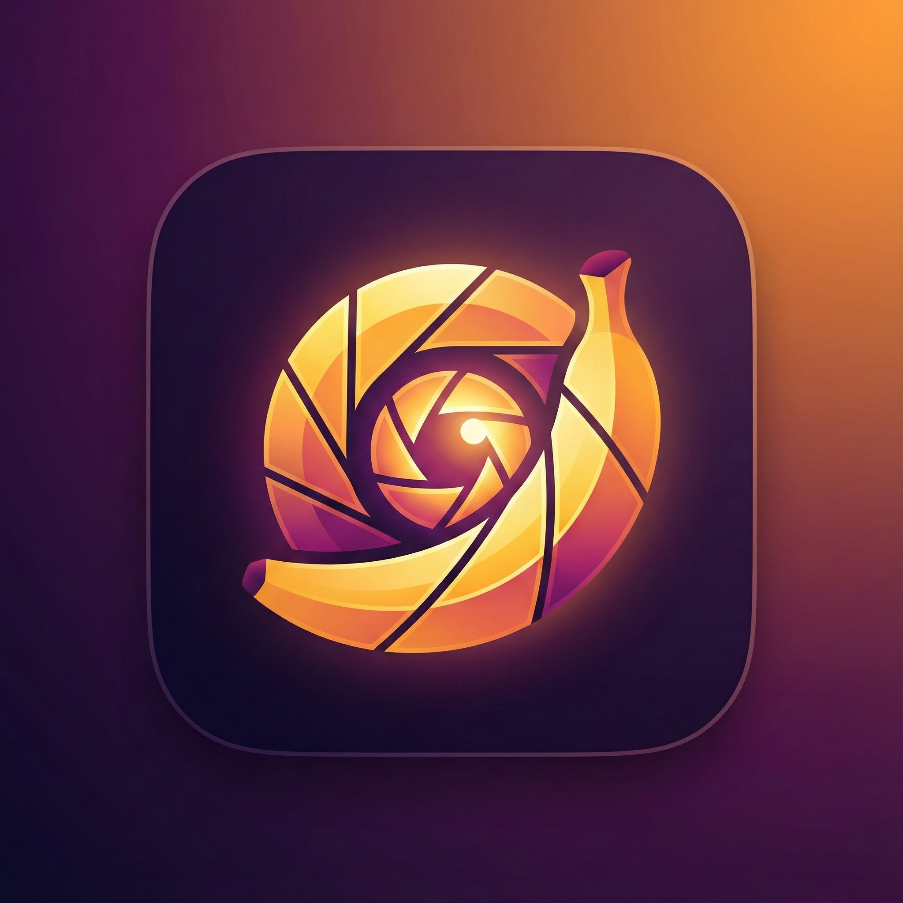
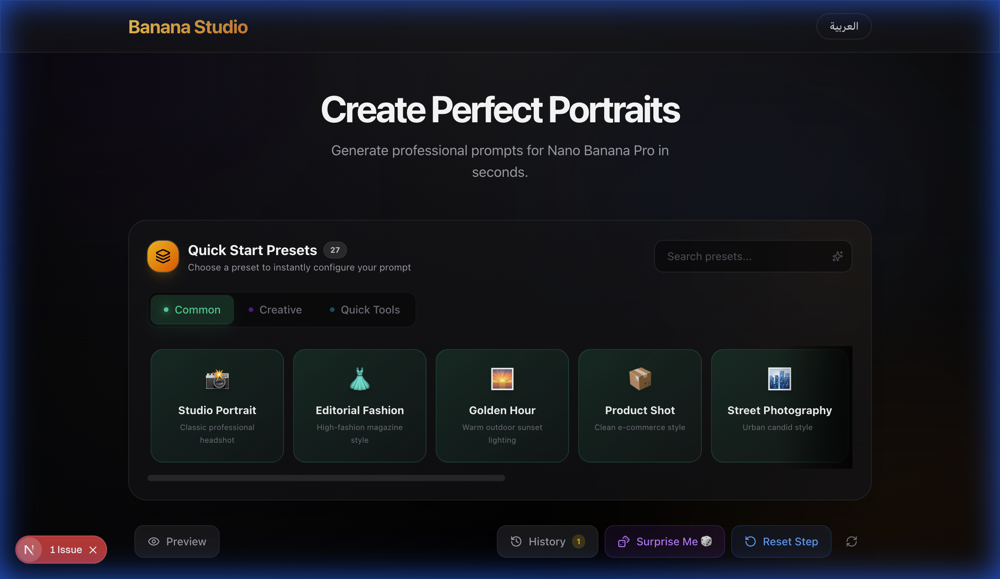

<div align="center">
  
  
  # Banana Prompt
  ### Create Perfect Portraits with AI

  **Banana Prompt** is a high-end, professional prompt generation tool designed specifically for **Nano Banana Pro / Gemini**. It empowers creators to craft detailed, high-quality portrait prompts with a seamless, premium interface.

  [English](README.md) • [العربية](README.md) *(i18n ready)*

  ---

  

</div>

## ✨ Key Features

- 🎭 **Professional Prompt Engine**: Generate precise prompts by selecting subject, styles, actions, and contexts.
- 🎨 **Premium UI/UX**: A modern, sleek interface with glassmorphism effects, optimized for both desktop and mobile.
- 🌍 **Full i18n Support**: Seamless switching between English and Arabic, with full RTL support.
- 💾 **History & Favorites**: Your generated prompts are saved locally so you never lose a great idea.
- 🚀 **One-Click Workflow**: Quick copy-to-clipboard and reset functionality for a fast creative process.

## 🛠️ Tech Stack

- **Framework**: [Next.js 16](https://nextjs.org/) (App Router)
- **Styling**: [Tailwind CSS 4](https://tailwindcss.com/)
- **Language**: [TypeScript](https://www.typescriptlang.org/)
- **Icons**: [Lucide React](https://lucide.dev/)
- **Persistence**: LocalStorage for history and settings.

## 🚀 Getting Started

### Prerequisites

- Node.js 18+ 
- npm / yarn / pnpm

### Installation

1. **Clone the repository**:
   ```bash
   git clone https://github.com/your-username/banana-studio.git
   cd banana-studio
   ```

2. **Install dependencies**:
   ```bash
   npm install
   ```

3. **Run the development server**:
   ```bash
   npm run dev
   ```

4. **Open the app**:
   Navigate to [http://localhost:3000](http://localhost:3000) in your browser.

## 📁 Project Structure

```text
src/
├── app/            # Next.js App Router (Pages, Layouts, Metadata)
├── components/     # Reusable UI Components (PromptForm, Header, etc.)
├── i18n/           # Internationalization (Translations)
├── lib/            # Utility functions and types
└── public/         # Static assets (Logos, Icons, Screenshots)
```

## 🗺️ Roadmap

Check out our [Roadmap](docs/roadmap.md) to see what's planned for future releases.

## 🤝 Contributing

We welcome contributions! Please see our [Contributing Guide](CONTRIBUTING.md) for details.

## 📄 License

This project is licensed under the MIT License - see the [LICENSE](LICENSE) file for details. *(Note: Add a LICENSE file if needed)*

---

<div align="center">
  Made with 🍌 by Banana Prompt Team
</div>
